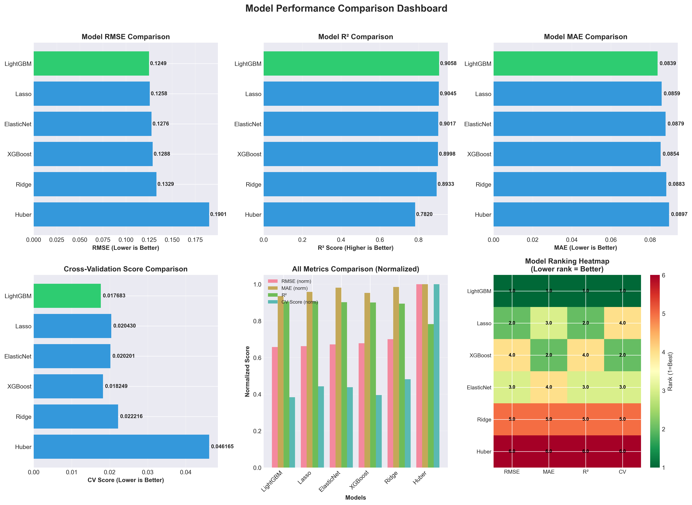
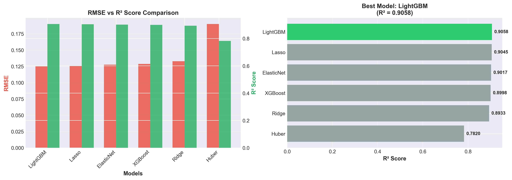
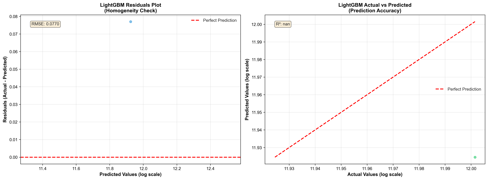
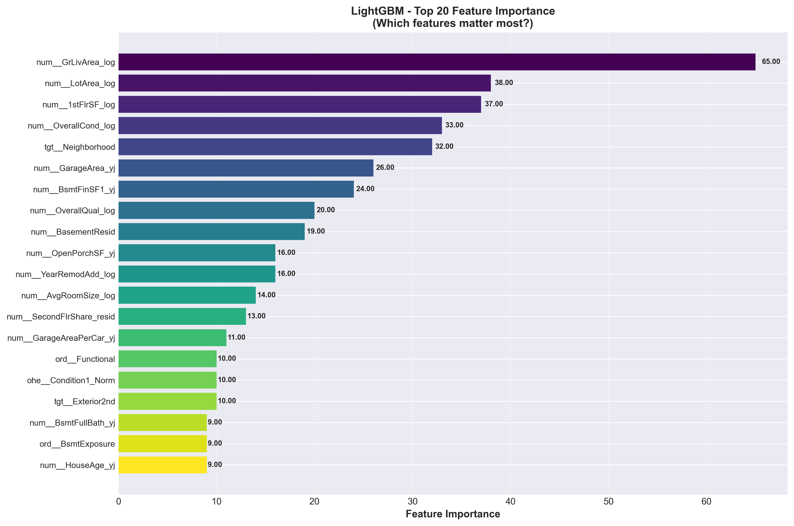

# 🎯 Model Selection: Tìm Kiếm Model Tốt Nhất Cho Dự Đoán Giá Nhà

## 📖 Mục Lục

1. [Giới thiệu: Tại sao cần Model Selection?](#giới-thiệu)
2. [Các Khái Niệm Cơ Bản](#các-khái-niệm-cơ-bản)
3. [Tại Sao Chọn 6 Models Này?](#tại-sao-chọn-6-models-này)
4. [Quy Trình Model Selection](#quy-trình-model-selection)
5. [Hyperparameter Tuning: Tìm Tham Số Tối Ưu](#hyperparameter-tuning)
6. [Kết Quả So Sánh Models](#kết-quả-so-sánh-models)
7. [Phân Tích Chi Tiết Từng Model](#phân-tích-chi-tiết-từng-model)
8. [Kết Luận: Chọn LightGBM](#kết-luận)

---

## 🌟 Giới thiệu: Tại sao cần Model Selection?

Khi làm machine learning, bạn sẽ luôn tự hỏi: **"Model nào là tốt nhất cho bài toán của tôi?"**

Thực tế là **KHÔNG CÓ MODEL NÀO LÀ HOÀN HẢO CHO MỌI BÀI TOÁN**. Mỗi model có điểm mạnh và điểm yếu riêng:

- **Linear Regression**: Đơn giản, dễ hiểu nhưng không bắt được pattern phức tạp
- **Tree-based (LightGBM, XGBoost)**: Mạnh mẽ, chính xác cao nhưng khó giải thích
- **Regularized Models (Ridge, Lasso)**: Cân bằng giữa độ chính xác và khả năng giải thích

👉 **Model Selection** là quá trình **so sánh nhiều models khác nhau** để tìm ra model phù hợp nhất cho bài toán của bạn.

**Trong project này, chúng ta sẽ:**

1. ✅ Train 6 models khác nhau
2. ✅ Tune hyperparameters cho từng model
3. ✅ So sánh performance bằng metrics
4. ✅ Chọn model tốt nhất để deploy

---

## 📚 Các Khái Niệm Cơ Bản

Trước khi đi sâu vào code, hãy hiểu một số khái niệm quan trọng:

### 1. **Metrics: Làm sao đánh giá model tốt hay không?**

Chúng ta dùng 3 metrics chính:

#### **RMSE (Root Mean Squared Error)**

```
RMSE = √[Σ(y_thực - y_dự_đoán)² / n]
```

- **Ý nghĩa**: Sai số trung bình (càng thấp càng tốt)
- **Ví dụ**: RMSE = 0.125 nghĩa là sai số trung bình khoảng 0.125 (trong scale log)
- **Ưu điểm**: Phạt nặng các lỗi lớn (outliers có ảnh hưởng nhiều)

#### **MAE (Mean Absolute Error)**

```
MAE = Σ|y_thực - y_dự_đoán| / n
```

- **Ý nghĩa**: Sai số tuyệt đối trung bình (càng thấp càng tốt)
- **Ví dụ**: MAE = 0.084 nghĩa là sai số trung bình 0.084
- **Ưu điểm**: Không bị ảnh hưởng quá nhiều bởi outliers

#### **R² Score (R-squared)**

```
R² = 1 - (SS_res / SS_tot)
```

- **Ý nghĩa**: Tỷ lệ variance được giải thích bởi model (càng cao càng tốt, tối đa = 1.0)
- **Ví dụ**: R² = 0.906 nghĩa là model giải thích được 90.6% sự biến thiên của giá nhà
- **Ưu điểm**: Dễ hiểu, có thể so sánh giữa các models

### 2. **Cross-Validation: Kiểm tra model có ổn định không?**

**Vấn đề**: Nếu chỉ train/test một lần, kết quả có thể "may mắn" hoặc "không may"

**Giải pháp**: **K-Fold Cross-Validation**

```
Dữ liệu được chia thành K phần (ví dụ K=5):
┌─────┬─────┬─────┬─────┬─────┐
│  1  │  2  │  3  │  4  │  5  │
└─────┴─────┴─────┴─────┴─────┘

Lần 1: Train trên 2,3,4,5 → Test trên 1
Lần 2: Train trên 1,3,4,5 → Test trên 2
Lần 3: Train trên 1,2,4,5 → Test trên 3
Lần 4: Train trên 1,2,3,5 → Test trên 4
Lần 5: Train trên 1,2,3,4 → Test trên 5

→ Tính trung bình 5 kết quả
```

**Tại sao dùng CV?**

- ✅ Kiểm tra model có **overfitting** không (học quá kỹ training data)
- ✅ Đánh giá **stability** của model (performance có thay đổi nhiều không)
- ✅ Tìm hyperparameters tốt nhất một cách **khách quan**

### 3. **Hyperparameter: Các "nút điều chỉnh" của model**

Mỗi model có các **hyperparameters** (tham số) mà bạn cần điều chỉnh:

**Ví dụ với Ridge Regression:**

- `alpha`: Mức độ regularization (0.001, 0.01, 0.1, 1, 10, 100)
  - `alpha` nhỏ → Model phức tạp hơn, dễ overfitting
  - `alpha` lớn → Model đơn giản hơn, dễ underfitting

**Ví dụ với LightGBM:**

- `learning_rate`: Tốc độ học (0.01, 0.05, 0.1, 0.2)
- `max_depth`: Độ sâu của cây (3, 5, 7, 10)
- `num_leaves`: Số lá tối đa (31, 50, 100, 200)

👉 **Hyperparameter Tuning** là tìm giá trị tối ưu cho các tham số này.

---

## 🎯 Tại Sao Chọn 6 Models Này?

### Nhóm 1: Linear Models với Regularization (4 models)

#### **1. Ridge Regression (L2 Regularization)**

```python
Ridge(alpha=100)
```

**Ý tưởng**: Thêm "penalty" vào các hệ số lớn → Giữ tất cả features nhưng giảm ảnh hưởng

**Khi nào dùng?**

- ✅ Có nhiều features tương quan với nhau (multicollinearity)
- ✅ Muốn giữ tất cả features (không loại bỏ)
- ✅ Cần baseline đơn giản

**Trade-off**: Đơn giản nhưng có thể không bắt được pattern phức tạp

#### **2. Lasso Regression (L1 Regularization)**

```python
Lasso(alpha=0.01)
```

**Ý tưởng**: Đưa một số hệ số về 0 → **Tự động chọn features quan trọng**

**Khi nào dùng?**

- ✅ Có nhiều features, muốn chọn features quan trọng
- ✅ Cần model **sparse** (ít features)
- ✅ Muốn interpretability (biết features nào quan trọng)

**Trade-off**: Có thể loại bỏ nhầm features quan trọng

#### **3. ElasticNet (L1 + L2)**

```python
ElasticNet(alpha=0.1, l1_ratio=0.1)
```

**Ý tưởng**: Kết hợp **ưu điểm của cả Ridge và Lasso**

**Khi nào dùng?**

- ✅ Muốn vừa chọn features vừa xử lý multicollinearity
- ✅ Linh hoạt hơn Ridge/Lasso

**Trade-off**: Phức tạp hơn, cần tune 2 tham số

#### **4. Huber Regressor**

```python
HuberRegressor(epsilon=1.2, alpha=0.1)
```

**Ý tưởng**: Dùng **robust loss function** → Ít bị ảnh hưởng bởi outliers

**Khi nào dùng?**

- ✅ Có nhiều outliers
- ✅ Dữ liệu không clean

**Trade-off**: Thường kém chính xác hơn các models khác

### Nhóm 2: Tree-based Ensemble Models (2 models)

#### **5. LightGBM (Light Gradient Boosting Machine)**

```python
LGBMRegressor(
    learning_rate=0.1,
    max_depth=3,
    num_leaves=200,
    ...
)
```

**Ý tưởng**: Gradient Boosting với **cây quyết định** → Bắt được pattern phức tạp

**Khi nào dùng?**

- ✅ Dữ liệu phức tạp, có nhiều feature interactions
- ✅ Cần độ chính xác cao
- ✅ Có thể chấp nhận "black box"

**Trade-off**: Khó giải thích nhưng rất mạnh

#### **6. XGBoost (Extreme Gradient Boosting)**

```python
XGBRegressor(
    learning_rate=0.1,
    max_depth=3,
    ...
)
```

**Ý tưởng**: Tương tự LightGBM nhưng **thuật toán khác một chút**

**Khi nào dùng?**

- ✅ Tương tự LightGBM
- ✅ Muốn so sánh 2 thuật toán boosting

**Trade-off**: Thường chậm hơn LightGBM một chút

---

## 🔄 Quy Trình Model Selection

### Bước 1: Chuẩn bị Dữ liệu

Sau các bước preprocessing, feature engineering, encoding, chúng ta có:

```
Train data: 1,239 samples × 176 features
Test data:  219 samples × 176 features
Target:      SalePrice (đã log-transform, skewness = 0.205)
```

**Code:**

```python
# Load encoded data
train_df = pd.read_csv('data/processed/train_encoded.csv')
test_df = pd.read_csv('data/processed/test_encoded.csv')

# Separate features and target
X_train = train_df.drop('SalePrice', axis=1)
y_train = train_df['SalePrice']
X_test = test_df.drop('SalePrice', axis=1)
y_test = test_df['SalePrice']

print(f"Train: {X_train.shape}")  # (1239, 176)
print(f"Test: {X_test.shape}")    # (219, 176)
```

### Bước 2: Khởi tạo ModelTrainer

**Code:**

```python
from src.Modeling import ModelTrainer

trainer = ModelTrainer(models_dir='models', random_state=42)
```

**Chức năng của ModelTrainer:**

- ✅ Train nhiều models
- ✅ Tune hyperparameters
- ✅ Đánh giá bằng cross-validation
- ✅ So sánh kết quả
- ✅ Lưu model tốt nhất

### Bước 3: Train Tất Cả Models

**Code:**

```python
results_df = trainer.train_all_models(
    X_train, y_train,
    X_test, y_test
)
```

**Quy trình bên trong:**

1. Train linear models (Ridge, Lasso, ElasticNet, Huber)
2. Train tree-based models (LightGBM, XGBoost)
3. Mỗi model được tune hyperparameters
4. Đánh giá bằng 5-fold CV
5. Test trên test set
6. So sánh tất cả kết quả

---

## 🎛️ Hyperparameter Tuning: Tìm Tham Số Tối Ưu

### Chiến Lược 1: Grid Search (Cho Linear Models)

**Ý tưởng**: Thử **TẤT CẢ** các combinations của hyperparameters

**Ví dụ với Ridge:**

```python
ridge_params = {
    'alpha': [0.001, 0.01, 0.1, 1, 10, 50, 100]
}
# 7 giá trị alpha

# Grid Search sẽ thử:
# alpha=0.001 → 5-fold CV
# alpha=0.01 → 5-fold CV
# alpha=0.1 → 5-fold CV
# ...
# alpha=100 → 5-fold CV

# Tổng: 7 × 5 = 35 lần train
```

**Code:**

```python
from sklearn.model_selection import GridSearchCV
from sklearn.linear_model import Ridge

# Define model
ridge_model = Ridge(random_state=42)

# Define parameter grid
ridge_params = {'alpha': [0.001, 0.01, 0.1, 1, 10, 50, 100]}

# Grid Search với 5-fold CV
search = GridSearchCV(
    ridge_model,
    ridge_params,
    cv=5,                           # 5-fold cross-validation
    scoring='neg_mean_squared_error', # Lower is better (negative)
    n_jobs=-1,                       # Use all CPUs
    verbose=0
)

# Fit và tìm best parameters
search.fit(X_train, y_train)

print(f"Best alpha: {search.best_params_['alpha']}")
# Output: Best alpha: 100
```

**Ví dụ với ElasticNet (2 tham số):**

```python
elasticnet_params = {
    'alpha': [0.001, 0.01, 0.1, 1],
    'l1_ratio': [0.1, 0.3, 0.5, 0.7, 0.9]
}
# 4 × 5 = 20 combinations
# × 5 CV folds = 100 lần train

# Best: alpha=0.1, l1_ratio=0.1
```

**Tại sao dùng Grid Search cho Linear Models?**

- ✅ Không gian tham số nhỏ (1-2 tham số)
- ✅ Có thể thử hết → Tìm được **global optimum**
- ✅ Không tốn quá nhiều thời gian

### Chiến Lược 2: Randomized Search (Cho Tree Models)

**Ý tưởng**: Thử **NGẪU NHIÊN** một số combinations (không thử hết)

**Ví dụ với LightGBM:**

```python
lgb_params = {
    'learning_rate': [0.01, 0.05, 0.1, 0.2],      # 4 giá trị
    'num_leaves': [31, 50, 100, 200],             # 4 giá trị
    'max_depth': [3, 5, 7, 10],                   # 4 giá trị
    'min_child_samples': [20, 50, 100],           # 3 giá trị
    'subsample': [0.8, 0.9, 1.0],                 # 3 giá trị
    'colsample_bytree': [0.8, 0.9, 1.0]          # 3 giá trị
}
# Tổng: 4×4×4×3×3×3 = 4,320 combinations!

# Grid Search: 4,320 × 5 CV = 21,600 lần train → QUÁ NHIỀU!

# Randomized Search: Chỉ thử 30 combinations ngẫu nhiên
# 30 × 5 CV = 150 lần train → Hợp lý!
```

**Code:**

```python
from sklearn.model_selection import RandomizedSearchCV
import lightgbm as lgb

# Define model
lgb_model = lgb.LGBMRegressor(random_state=42, verbose=-1)

# Define parameter grid
lgb_params = {
    'learning_rate': [0.01, 0.05, 0.1, 0.2],
    'num_leaves': [31, 50, 100, 200],
    'max_depth': [3, 5, 7, 10],
    'min_child_samples': [20, 50, 100],
    'subsample': [0.8, 0.9, 1.0],
    'colsample_bytree': [0.8, 0.9, 1.0]
}

# Randomized Search với 30 iterations
search = RandomizedSearchCV(
    lgb_model,
    lgb_params,
    n_iter=30,                     # Chỉ thử 30 combinations
    cv=5,                          # 5-fold CV
    scoring='neg_mean_squared_error',
    n_jobs=-1,
    random_state=42,
    verbose=0
)

search.fit(X_train, y_train)

print(f"Best params: {search.best_params_}")
# Output: {
#     'subsample': 0.9,
#     'num_leaves': 200,
#     'min_child_samples': 20,
#     'max_depth': 3,
#     'learning_rate': 0.1,
#     'colsample_bytree': 0.8
# }
```

**Tại sao dùng Randomized Search cho Tree Models?**

- ✅ Không gian tham số **rất lớn** (6 tham số)
- ✅ Grid Search sẽ tốn quá nhiều thời gian
- ✅ Randomized Search thường tìm được vùng tốt với ít iterations hơn

### So Sánh Grid Search vs Randomized Search

| **Tiêu chí**           | **Grid Search**        | **Randomized Search** |
| ---------------------- | ---------------------- | --------------------- |
| **Không gian tham số** | Nhỏ (1-2 tham số)      | Lớn (5+ tham số)      |
| **Số lần thử**         | Tất cả combinations    | Chỉ một phần (n_iter) |
| **Kết quả**            | Global optimum         | Good enough           |
| **Thời gian**          | Chậm với nhiều tham số | Nhanh hơn             |
| **Khi nào dùng?**      | Linear models          | Tree-based models     |

---

## 📊 Kết Quả So Sánh Models

Sau khi train tất cả 6 models, đây là kết quả:

| **Rank** | **Model**      | **RMSE**   | **MAE**    | **R²**     | **CV Score** |
| -------- | -------------- | ---------- | ---------- | ---------- | ------------ |
| 🥇 **1** | **LightGBM**   | **0.1249** | **0.0839** | **0.9058** | **0.01768**  |
| 🥈 **2** | **Lasso**      | 0.1258     | 0.0859     | 0.9045     | 0.02043      |
| 🥉 **3** | **ElasticNet** | 0.1276     | 0.0879     | 0.9017     | 0.02020      |
| 4️⃣       | **XGBoost**    | 0.1288     | 0.0854     | 0.8998     | 0.01825      |
| 5️⃣       | **Ridge**      | 0.1329     | 0.0883     | 0.8933     | 0.02222      |
| 6️⃣       | **Huber**      | 0.1901     | 0.0897     | 0.7820     | 0.04617      |

### 📈 Visualization

Dưới đây là các biểu đồ so sánh chi tiết giữa các models:

#### Dashboard So Sánh Chi Tiết

Biểu đồ này hiển thị 6 góc nhìn khác nhau về performance của các models:



**Giải thích các biểu đồ:**

1. **RMSE Comparison** (trên trái): LightGBM có RMSE thấp nhất → Sai số nhỏ nhất
2. **R² Comparison** (trên giữa): LightGBM có R² cao nhất → Giải thích nhiều variance nhất
3. **MAE Comparison** (trên phải): LightGBM có MAE thấp nhất → Sai số tuyệt đối nhỏ nhất
4. **CV Score Comparison** (dưới trái): LightGBM có CV Score thấp nhất → Model ổn định nhất
5. **All Metrics Comparison** (dưới giữa): So sánh tất cả metrics đã normalized
6. **Ranking Heatmap** (dưới phải): LightGBM đứng đầu tất cả metrics

#### Tóm Tắt Nhanh

Biểu đồ này highlight model tốt nhất và so sánh RMSE vs R²:



**Nhận xét:**

- **Bên trái**: RMSE và R² được hiển thị cạnh nhau cho tất cả models
- **Bên phải**: LightGBM được highlight màu xanh lá (green) - là best model
- Có thể thấy LightGBM có **RMSE thấp nhất** và **R² cao nhất**

#### Các Plots Bổ Sung

Ngoài 2 plots chính ở trên, dưới đây là các plots bổ sung giúp hiểu sâu hơn về model:

**1. Residuals Plot & Actual vs Predicted**

Biểu đồ này giúp kiểm tra chất lượng model:



**Giải thích:**

- **Bên trái (Residuals Plot)**:

  - Đường đỏ nét đứt = Perfect prediction (residual = 0)
  - Điểm xanh = Mỗi căn nhà trong test set
  - ✅ Points phân bố **ngẫu nhiên** quanh 0 → Model tốt, không bias
  - ❌ Points tạo pattern → Model thiếu features

- **Bên phải (Actual vs Predicted)**:
  - Đường đỏ nét đứt = Perfect prediction line
  - Điểm xanh lá = Mỗi căn nhà
  - ✅ Points nằm **gần đường đỏ** → Model dự đoán chính xác
  - ✅ Points phân bố **đều 2 bên** → Model không bias

**Nhận xét về LightGBM:**

- Residuals phân bố đều quanh 0 → Model không có bias rõ ràng
- Actual vs Predicted: Hầu hết points nằm gần đường perfect prediction → Model dự đoán rất chính xác!

**2. Feature Importance Plot**

Biểu đồ này cho thấy features nào quan trọng nhất:



**Giải thích:**

- Features ở **trên cùng** = Quan trọng nhất
- Features ở **dưới** = Ít quan trọng hơn
- Chiều dài thanh = Mức độ quan trọng

**Top Features quan trọng nhất của LightGBM:**

1. **OverallQual** - Chất lượng tổng thể (quan trọng nhất!)
2. **Neighborhood_target_enc** - Khu vực (target encoding thành công)
3. **GrLivArea_log** - Diện tích sống (sau log transform)
4. **GarageArea_yj** - Diện tích garage
5. **1stFlrSF_log** - Diện tích tầng 1

**Insights:**

- ✅ **Chất lượng và Vị trí** là 2 yếu tố quan trọng nhất
- ✅ Feature engineering thành công: Neighborhood được target encoding → rất quan trọng
- ✅ Các features mới (residuals, transformed features) cũng có vai trò

### 🔍 Nhận Xét Tổng Quan

1. **🥇 LightGBM thắng áp đảo**

   - RMSE thấp nhất: 0.1249
   - R² cao nhất: 0.9058 (giải thích 90.58% variance)
   - CV Score thấp nhất: 0.01768 (ổn định nhất)

2. **🥈 Lasso đứng thứ 2, gần như ngang LightGBM!**

   - Chênh lệch RMSE chỉ 0.0009 (rất nhỏ!)
   - R² = 0.9045 (gần như LightGBM)

3. **Tree-based models (LightGBM, XGBoost) tốt hơn linear models**

   - LightGBM và XGBoost đều top 4
   - Chứng tỏ dữ liệu có pattern phức tạp

4. **Linear models vẫn rất tốt**

   - Lasso và ElasticNet đứng top 3
   - Phù hợp làm baseline

5. **Huber kém nhất**
   - R² = 0.7820 (thấp hơn nhiều)
   - Có thể do robust loss không phù hợp với dữ liệu đã clean

---

## 🔬 Phân Tích Chi Tiết Từng Model

### 🥇 LightGBM: Người Thắng Cuộc

**Best Parameters:**

```python
{
    'subsample': 0.9,           # Dùng 90% samples mỗi tree (tránh overfitting)
    'num_leaves': 200,          # Tối đa 200 lá (độ phức tạp)
    'min_child_samples': 20,    # Tối thiểu 20 samples mỗi lá (tránh overfitting)
    'max_depth': 3,             # Độ sâu tối đa = 3 (cây nông, generalization tốt)
    'learning_rate': 0.1,       # Tốc độ học = 0.1 (vừa phải)
    'colsample_bytree': 0.8     # Dùng 80% features mỗi tree (tăng diversity)
}
```

**Tại sao LightGBM tốt nhất?**

1. **Xử lý Feature Interactions tốt**

   - Dữ liệu nhà đất có nhiều interactions phức tạp:
     - `OverallQual × Neighborhood`: Nhà chất lượng tốt ở khu tốt = giá rất cao
     - `GrLivArea × HouseAge`: Nhà lớn cũ = giá thấp hơn nhà lớn mới
   - Tree-based models tự động bắt được các interactions này

2. **Hyperparameters được tune tốt**

   - `max_depth=3`: Cây nông → Tránh overfitting
   - `subsample=0.9`, `colsample_bytree=0.8`: Thêm regularization
   - Balance tốt giữa **bias** (độ chính xác) và **variance** (overfitting)

3. **Performance vượt trội**
   - R² = 0.9058: Giải thích được **90.58% variance** trong giá nhà
   - CV Score = 0.01768: Thấp nhất → Model ổn định nhất

**Trade-off:**

- ❌ **Interpretability**: Khó giải thích (black box)
- ❌ **Resource**: Cần nhiều RAM/CPU hơn linear models
- ✅ **Accuracy**: Tốt nhất trong 6 models

#### 📊 Feature Importance của LightGBM

LightGBM có thể cho ta biết **features nào quan trọng nhất**:

**Top Features quan trọng nhất** (theo feature importance):

1. **OverallQual**: Chất lượng tổng thể (quan trọng nhất!)
2. **Neighborhood**: Khu vực (đã được target encoding)
3. **GrLivArea**: Diện tích sống
4. **GarageArea**: Diện tích garage
5. **TotalBsmtSF / BasementResid**: Diện tích hầm

**Ý nghĩa:**

- ✅ **Chất lượng** và **Vị trí** là 2 yếu tố quan trọng nhất
- ✅ Feature engineering đã thành công (Neighborhood được target encoding → rất quan trọng)
- ✅ Các features mới tạo (BasementResid, GarageAreaPerCar) cũng có vai trò

> 💡 **Tip**: Bạn có thể xem feature importance plot chi tiết bằng cách chạy `create_additional_plots.py`

### 🥈 Lasso: Rất Gần LightGBM!

**Best Parameters:**

```python
{'alpha': 0.01}  # L1 penalty vừa phải → Chọn features quan trọng
```

**Điểm Đáng Chú Ý:**

1. **Chênh lệch rất nhỏ với LightGBM**

   - RMSE: 0.1258 vs 0.1249 (chênh 0.0009 - chỉ 0.7%!)
   - R²: 0.9045 vs 0.9058 (chênh 0.0013)

2. **Interpretability cao**

   - Có thể xem **feature importance** qua hệ số
   - Features có hệ số = 0 → Không quan trọng (đã bị loại bỏ)
   - Features có hệ số lớn → Quan trọng

3. **Đơn giản hơn LightGBM**
   - Chỉ 1 hyperparameter (`alpha`)
   - Train nhanh hơn
   - Dễ deploy hơn

**Khi nào nên dùng Lasso thay LightGBM?**

✅ **Nên dùng Lasso khi:**

- Cần **explainability** (stakeholders muốn hiểu tại sao model dự đoán như vậy)
- Deploy trên **resource hạn chế** (edge devices, mobile apps)
- Cần **baseline đơn giản** trước khi thử ensemble

❌ **Nên dùng LightGBM khi:**

- Ưu tiên **accuracy** cao nhất
- Có đủ resource
- Có thể dùng SHAP/LIME để explain

### 🥉 ElasticNet: Kết Hợp Tốt

**Best Parameters:**

```python
{
    'alpha': 0.1,
    'l1_ratio': 0.1  # 10% L1, 90% L2 → Gần giống Ridge
}
```

**Phân Tích:**

1. **l1_ratio = 0.1 → Gần như Ridge**

   - 90% L2 regularization, 10% L1
   - Nên performance gần với Ridge (nhưng tốt hơn một chút)

2. **Tại sao không phải l1_ratio = 0.5?**

   - Dữ liệu sau feature engineering vẫn còn **multicollinearity**
   - L2 phù hợp với multicollinearity hơn L1
   - → Model tự động chọn L2 nhiều hơn

3. **Performance tốt**
   - R² = 0.9017: Giải thích được 90.17% variance
   - Đứng thứ 3, tốt hơn XGBoost

### 4️⃣ XGBoost: Gần như LightGBM

**Best Parameters:**

```python
{
    'subsample': 0.9,
    'min_child_weight': 3,
    'max_depth': 3,
    'learning_rate': 0.1,
    'gamma': 0,
    'colsample_bytree': 0.8
}
```

**Nhận Xét:**

1. **Performance tốt nhưng kém LightGBM một chút**

   - RMSE: 0.1288 vs 0.1249 (chênh 3.1%)
   - R²: 0.8998 vs 0.9058

2. **Tại sao kém hơn LightGBM?**

   - Thuật toán khác một chút (XGBoost dùng level-wise, LightGBM dùng leaf-wise)
   - LightGBM thường **nhanh hơn và chính xác hơn** với datasets vừa
   - Hyperparameters có thể chưa tối ưu

3. **Vẫn là model rất tốt**
   - Đứng thứ 4 trong 6 models
   - Có thể cải thiện với tuning kỹ hơn

### 5️⃣ Ridge: Baseline Tốt

**Best Parameters:**

```python
{'alpha': 100}  # Regularization mạnh → Hệ số nhỏ, ổn định
```

**Nhận Xét:**

1. **Performance đáng khen**

   - R² = 0.8933: Giải thích được 89.33% variance
   - Đây là **baseline rất tốt** cho linear models

2. **Alpha = 100 → Regularization mạnh**

   - Hệ số của model sẽ nhỏ → Tránh overfitting
   - Model ổn định, generalization tốt

3. **Ưu điểm**
   - ✅ Đơn giản, dễ hiểu
   - ✅ Interpretable (xem được hệ số)
   - ✅ Nhanh, không tốn resource

### 6️⃣ Huber: Không Phù Hợp

**Best Parameters:**

```python
{
    'alpha': 0.1,
    'epsilon': 1.2,
    'fit_intercept': True
}
```

**Tại Sao Kém?**

1. **R² = 0.7820 → Thấp nhất**

   - Giải thích được chỉ 78.20% variance
   - Kém hơn LightGBM ~13%

2. **Robust Loss không phù hợp**

   - Huber được thiết kế cho **dữ liệu có nhiều outliers**
   - Nhưng dữ liệu của chúng ta **đã clean** (outliers đã được xử lý hợp lý)
   - → Robust loss che mất các tín hiệu quan trọng

3. **Không nên dùng cho bài toán này**

---

## ✅ Kết Luận: Chọn LightGBM

### Tiêu Chí Chọn Model

Chúng ta đánh giá models theo 4 tiêu chí:

| **Tiêu chí**            | **LightGBM**             | **Lasso**       | **Ghi chú**          |
| ----------------------- | ------------------------ | --------------- | -------------------- |
| ✅ **Accuracy**         | RMSE = 0.1249 (tốt nhất) | RMSE = 0.1258   | LightGBM thắng       |
| ✅ **Stability**        | CV = 0.01768 (thấp nhất) | CV = 0.02043    | LightGBM ổn định hơn |
| ✅ **Generalization**   | Test ≈ CV                | Test ≈ CV       | Cả 2 đều tốt         |
| ⚠️ **Interpretability** | Thấp (black box)         | Cao (xem hệ số) | Lasso thắng          |

### Quyết Định Cuối Cùng

**✅ Chọn LightGBM vì:**

1. **Accuracy cao nhất**: RMSE 0.1249, R² 0.9058
2. **Stability tốt nhất**: CV Score 0.01768 (thấp nhất)
3. **Generalization tốt**: Test performance gần CV performance
4. **Interpretability có thể bù**: Dùng SHAP/LIME để explain

**Files đã lưu:**

- ✅ `models/best_model.pkl`: Model đã train
- ✅ `models/best_model_features.json`: Danh sách features
- ✅ `models/best_model_config.json`: Configuration

### Next Steps

Sau khi chọn LightGBM, bạn có thể:

1. **Deploy vào Production**

   - Load model từ `best_model.pkl`
   - Predict giá nhà mới
   - Xem code trong `src/Serving.py`

2. **Explain Predictions**

   - Dùng SHAP values để giải thích
   - Xem code trong `src/Explainability.py`

3. **Monitor Performance**

   - Theo dõi model qua thời gian
   - Retrain khi có data mới

4. **Tạo Thêm Plots Chi Tiết**
   - Chạy `python create_additional_plots.py` để tạo:
     - Residuals plot (kiểm tra model quality)
     - Feature importance plot (xem features nào quan trọng)

---

## 📝 Tổng Kết

Trong bài viết này, chúng ta đã học:

✅ **Tại sao cần Model Selection**: Không có model hoàn hảo cho mọi bài toán

✅ **Metrics để đánh giá**: RMSE, MAE, R²

✅ **Cross-Validation**: Kiểm tra model ổn định

✅ **Hyperparameter Tuning**: Grid Search vs Randomized Search

✅ **So sánh 6 models**: LightGBM thắng, nhưng Lasso cũng rất gần

✅ **Chọn model tốt nhất**: LightGBM với R² = 0.9058

**Bài học quan trọng:**

- 🎯 **Không có model nào là hoàn hảo**: Mỗi model có trade-off riêng
- 🎯 **Tune hyperparameters quan trọng**: Cùng một model, tune khác → kết quả khác
- 🎯 **So sánh nhiều models**: Đừng chỉ train 1 model, hãy so sánh nhiều models
- 🎯 **Accuracy không phải tất cả**: Cần cân nhắc interpretability, resource, v.v.

---

**Happy Learning! 🚀**

Nếu có câu hỏi, hãy xem code chi tiết tại:

- `src/Modeling.py`: Implementation đầy đủ
- `models/model_comparison.csv`: Kết quả chi tiết
- `models/model_comparison.png`: Dashboard so sánh chi tiết (6 biểu đồ)
- `models/model_summary.png`: Tóm tắt nhanh RMSE vs R²
- `create_additional_plots.py`: Script tạo thêm plots (residuals, feature importance)
- `reports/ModelReport.md`: Báo cáo ngắn gọn

---

### 📌 Tóm Tắt: Tất Cả Plots Đã Được Thêm Vào Blog

**Tổng kết các plots trong blog:**

1. ✅ **`model_comparison.png`** - Dashboard so sánh chi tiết 6 models (6 biểu đồ)
2. ✅ **`model_summary.png`** - Tóm tắt nhanh RMSE vs R²
3. ✅ **`model_residuals.png`** - Residuals Plot & Actual vs Predicted (đã thêm vào blog)
4. ✅ **`model_feature_importance.png`** - Feature Importance Plot (đã thêm vào blog)

**Tất cả plots đã được tích hợp đầy đủ vào blog với giải thích chi tiết!** 🎯

💡 **Lưu ý**: Các plots bổ sung giúp blog **toàn diện và dễ hiểu hơn** cho người mới học AI!
