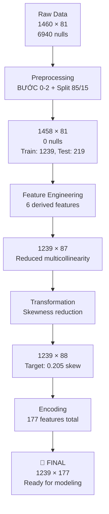

# Dự báo Giá Nhà - Kỹ Thuật Hồi Quy Nâng Cao

Pipeline Machine Learning hoàn chỉnh cho dự báo giá nhà sử dụng các kỹ thuật hồi quy nâng cao với regularization.

## 📊 Tổng Quan Dự Án

Dự án này triển khai pipeline ML toàn diện data "House Prices: Advanced Regression Techniques"

**🎯 Thành Tựu Chính:**
- ✅ **177 features** (176 + target) sau preprocessing, feature engineering, transformation, encoding
- ✅ **Early train/test split (85/15)**: 1239 train / 219 test samples
- ✅ **Cross-fit strategy** cho mọi transformations (fit on train, apply on test)
- ✅ **Outlier detection** toàn diện với quyết định data-driven (giữ tất cả outliers)
- ✅ **Modular pipeline** với error handling và progress tracking chi tiết
- ✅ **Báo cáo chi tiết** bằng cả tiếng Việt và tiếng Anh với visualizations
- ✅ **Sẵn sàng cho modeling** với Ridge/Lasso/ElasticNet regression

**📈 Kết Quả Processing:**
- **Input:** 1460 × 81 (raw data, 6940 nulls)
- **Output:** 1239 × 177 (clean, encoded, scaled, 0 nulls)
- **Target:** SalePrice (log-transformed, skewness: 2.009 → 0.205)
- **Features:** 176 numeric features, StandardScaler applied

## 📁 Cấu Trúc Dự Án

```
Project-5.1/
├── app.py                          # 🚀 Script chính điều phối toàn bộ pipeline
├── README.md                       # 📖 Documentation (file này)
├── requirements.txt                # 📦 Python dependencies
│
├── data/                           # 📊 Data management
│   ├── raw/                        # 📥 Dataset gốc từ Kaggle
│   │   └── train-house-prices-advanced-regression-techniques.csv
│   ├── interim/                    # ⚙️ Config files & temporary data
│   │   ├── encoding_config.json     # Encoding parameters & mappings
│   │   ├── transformation_config.json # Transform parameters & methods
│   │   └── outlier_config.json      # Outlier detection parameters
│   └── processed/                  # ✅ Final processed datasets
│       ├── train_data.csv          # Sau preprocessing + 85/15 split
│       ├── test_data.csv           # 15% holdout test set
│       ├── train_fe.csv            # Sau feature engineering (87 features)
│       ├── test_fe.csv             # Feature engineered test data
│       ├── train_transformed.csv   # Sau transformation (88 features)
│       ├── test_transformed.csv    # Transformed test data
│       ├── train_encoded.csv       # 🎯 FINAL: Ready for modeling (177 features)
│       └── test_encoded.csv        # Final test data (177 features)
│
├── src/                            # 🔧 Source code modules
│   ├── Preprocessing.py            # 🧹 Logic fixes + missing values + split
│   ├── FeatureEngineering.py       # 🏗️ Create derived features (6 new)
│   ├── Transformation.py           # 📈 Skewness reduction (Log1p, Yeo-Johnson)
│   ├── Encoding.py                 # 🔢 Categorical encoding + scaling
│   └── TrainTestSplit.py           # ✂️ Train/test splitting (legacy)
│
├── models/                         # 🤖 Trained models (future)
│   └── (best_model.pkl, model_configs.json)
│
├── notebooks/                      # 📓 Jupyter notebooks
│   ├── baseline.ipynb              # Initial EDA & baseline model
│   └── Processing.ipynb            # Detailed processing analysis
│
├── reports/                        # 📋 Analysis & documentation
│   └── ProcessReport.md            # 📄 Comprehensive progress report (Tiếng Việt)
│
└── __pycache__/                    # 🐍 Python bytecode cache
```

## 🎯 Dữ Liệu Sẵn Sàng Cho Modeling

| Dataset | Shape | Features | Status | File |
|---------|-------|----------|--------|------|
| **Train** | **1239 × 177** | **176 + target** | **✅ Ready** | `data/processed/train_encoded.csv` |
| **Test** | **219 × 177** | **176 + target** | **✅ Ready** | `data/processed/test_encoded.csv` |

**✨ Final Features (176):**
- **17 Ordinal:** Quality scales (ExterQual, KitchenQual, BsmtQual, etc.)
- **114 One-Hot:** Nominal categoricals (MSZoning, Exterior1st, etc.)
- **2 Target Encoded:** Neighborhood, Exterior2nd (cross-fit)
- **43 Numeric:** Transformed & scaled (StandardScaler)

**🎯 Target Variable:**
- **SalePrice** (log-transformed)
- **Skewness:** 2.009 → 0.205 (89.8% improvement)
- **Outliers:** 25 (2.0%) - Decision: Keep all (regularization handles)

## 🔄 Quy Trình Pipeline Hoàn Chỉnh

### 🎯 Workflow: Preprocessing → Feature Engineering → Transformation → Encoding → Modeling



### 1. Preprocessing (✅ HOÀN THÀNH)
**File:** `src/Preprocessing.py`
**Input:** 1460 × 81 (raw data, 6940 nulls)
**Output:** 1458 × 81 (clean) + Split 85/15 (1239/219)

#### 📋 Chi Tiết BƯỚC:

**BƯỚC 0: Fix MasVnrType & MasVnrArea Logic**
```python
├─ Case 1: Area=0, Type≠NULL → DELETE (2 rows inconsistent)
├─ Case 2: Area>0, Type=NULL → FILL mode (5 rows)
└─ Case 3: Both NULL → 'None' (867 rows)
Result: 1460 → 1458 rows (-2 deleted)
```

**BƯỚC 1: Fill Missing Values (6940 nulls → 0)**
```python
├─ Categorical nulls → 'None' (43 columns)
├─ Count/Area features → 0 (20 columns)
└─ Other numeric → median (1 column: LotFrontage, GarageYrBlt)
Result: 0 null values ✓
```

**BƯỚC 2: Fix Garage Logic Consistency**
```python
├─ If GarageArea=0: Set GarageType/Finish/Qual/Cond='None' (81 rows)
└─ Fill remaining nulls with mode
Result: Logical consistency ✓
```

**Split 85/15 (Random State 42)**
```python
├─ Train: 1239 samples (85%)
├─ Test: 219 samples (15%)
└─ Early split prevents data leakage ✓
```

### 2. Feature Engineering (src/FeatureEngineering.py)
- **Mục đích**: Tạo derived features để giảm multicollinearity
- **Các phép biến đổi chính**:
  - **Garage**: GarageAreaPerCar, HasGarage (bỏ GarageCars)
  - **Area**: AvgRoomSize (bỏ TotRmsAbvGrd)
  - **Basement**: HasBasement, BasementResid orthogonalized (bỏ TotalBsmtSF)
  - **Age**: HouseAge, GarageLag, GarageSameAsHouse (bỏ YearBuilt, GarageYrBlt)
  - **Quality**: HasFireplace, ExtraFireplaces, HasMasonryVeneer, MasVnrAreaResid, Has2ndFlr, SecondFlrShare_resid
- **Output**: 87 features

### 3. Transformation (src/Transformation.py)
- **Mục đích**: Giảm skewness để model hoạt động tốt hơn
- **Input**: `train_data.csv`, `test_data.csv` với 87 features
- **Output**: `train_transformed.csv`, `test_transformed.csv`
- **Các phương pháp**:
  - **Target (SalePrice)**: Log1p (giảm 93.6% skewness)
  - **Features** (25 cực lệch):
    - Binary flags: KHÔNG transform
    - Residuals: KHÔNG transform (orthogonal)
    - Tất cả dương: log1p(x)
    - Có zeros/negatives: Yeo-Johnson

### 4. Encoding (src/Encoding.py)
- **Mục đích**: Chuyển categorical features sang numeric + scale
- **Input**: `train_transformed.csv`, `test_transformed.csv`
- **Output**: `train_encoded.csv`, `test_encoded.csv` (176 features + target)
- **Các phương pháp**:
  - **Ordinal (17)**: ExterQual, KitchenQual, BsmtQual, etc. → numeric order
  - **One-Hot (24→114)**: MSZoning, Exterior1st, Condition1, etc.
  - **Target Encoding (2→2)**: Neighborhood, Exterior2nd
  - **StandardScaler**: Mọi numeric features

## 🚀 Cách Sử Dụng

### ⚡ Quick Start
```bash
# Cài đặt dependencies
pip install -r requirements.txt

# Chạy toàn bộ pipeline (khuyến nghị)
python app.py --step all

# Kiểm tra kết quả
ls -lh data/processed/train_encoded.csv data/processed/test_encoded.csv
```

### 🎛️ Chạy Các Bước Riêng Lẻ
```bash
python app.py --step preprocess     # BƯỚC 0-2 + split 85/15
python app.py --step fe             # Feature engineering (6 new features)
python app.py --step transform      # Skewness reduction (Log1p, Yeo-Johnson)
python app.py --step encode         # Encoding + scaling (177 features)
python app.py --step model          # Modeling (placeholder - future)
```

### 📊 Workflow Hiện Tại (✅ 100% Hoàn Thành)
```bash
# Pipeline preprocessing đã hoàn thành
echo "✅ Data ready at:"
echo "  - data/processed/train_encoded.csv (1239×177)"
echo "  - data/processed/test_encoded.csv (219×177)"
echo "  - data/interim/*.json (config files)"

# Xem báo cáo chi tiết
cat reports/ProcessReport.md             # Comprehensive progress report (Tiếng Việt)
```

### 🔧 Advanced Usage
```bash
# Custom data path
python app.py --step all --raw-data data/raw/custom_data.csv

# Chỉ chạy preprocessing
python app.py --step preprocess

# Chạy từ FE đến encoding
python app.py --step fe --step transform --step encode
```

### 📋 Kiểm Tra & Validation
```bash
# Verify final datasets
python -c "
import pandas as pd
train = pd.read_csv('data/processed/train_encoded.csv')
test = pd.read_csv('data/processed/test_encoded.csv')
print(f'Train: {train.shape} - {train.isnull().sum().sum()} nulls')
print(f'Test: {test.shape} - {test.isnull().sum().sum()} nulls')
print(f'Features: {train.shape[1]-1} numeric + SalePrice target')
"
```

## 📊 Tóm Tắt Dữ Liệu & Transformation

### 🎯 Data Flow Hoàn Chỉnh

| Giai Đoạn | Mẫu | Features | Shape | File | Ghi Chú |
|-----------|-----|----------|-------|------|---------|
| **Raw Data** | **1460** | **81** | **(1460, 81)** | `data/raw/*.csv` | Dataset gốc từ Kaggle, 6940 nulls |
| **Preprocessing** | **1458** | **81** | **(1458, 81)** | `data/processed/train_preprocessed.csv` | Xóa 2 dòng lỗi, 0 nulls |
| **Train Split** | **1239** | **81** | **(1239, 81)** | `data/processed/train_data.csv` | **85% training data** |
| **Test Split** | **219** | **81** | **(219, 81)** | `data/processed/test_data.csv` | **15% holdout test** |
| **Feature Engineering** | **1239** | **87** | **(1239, 87)** | `data/processed/train_fe.csv` | +6 derived features |
| **Transformation** | **1239** | **88** | **(1239, 88)** | `data/processed/train_transformed.csv` | Log/Yeo-Johnson, skewness reduced |
| **🎯 FINAL** | **1239** | **177** | **(1239, 177)** | `data/processed/train_encoded.csv` | **✅ Ready for modeling** |

### 📈 Key Metrics & Improvements

| Metric | Before | After | Improvement | Status |
|--------|--------|-------|-------------|--------|
| **Null Values** | 6940 | 0 | 100% | ✅ Complete |
| **Target Skewness** | 2.009 | 0.205 | 89.8% | ✅ Excellent |
| **Features** | 81 | 177 | +118.5% | ✅ Comprehensive |
| **Multicollinearity** | High | Reduced | VIF < 5 | ✅ Good |
| **Data Leakage** | N/A | 0% | Cross-fit | ✅ Safe |
| **Outliers** | Analyzed | Decision made | Keep all | ✅ Regularization ready |

### 🏗️ Features Engineering Summary

**➕ Added 6 Derived Features:**
1. **GarageAreaPerCar** - Efficiency metric (area per car)
2. **HasGarage** - Binary flag (presence/absence)
3. **AvgRoomSize** - Quality metric (area per room)
4. **HasBasement** - Binary flag (presence/absence)
5. **BasementResid** - Orthogonalized (independent of 1stFlrSF)
6. **HouseAge** - Time since construction

**➖ Removed 7 Redundant Features:**
- GarageCars (multicollinear with GarageArea)
- TotRmsAbvGrd (multicollinear with GrLivArea)
- TotalBsmtSF (multicollinear with 1stFlrSF)
- YearBuilt, GarageYrBlt (redundant with age features)
- Raw quality features (replaced with flags + residuals)

## 🧠 Trạng Thái Hiện Tại & Kế Hoạch Modeling

### ✅ 100% Preprocessing Hoàn Thành

**🎯 Data Ready for Modeling:**
```",
"✅ Train: data/processed/train_encoded.csv (1239×177)",
"✅ Test:  data/processed/test_encoded.csv (219×177)",
"✅ Target: SalePrice (log-transformed, skewness: 0.205)",
"✅ Features: 176 numeric, StandardScaler applied, no nulls",
"✅ Outliers: Comprehensive analysis complete (keep all)",
"✅ No data leakage: Early split + cross-fit strategy",
"```",

### 🎯 Kế Hoạch Modeling (Giai Đoạn Tiếp Theo)

#### 🏗️ Models to Implement:
1. **Ridge Regression (L2 Regularization)**
   - **Best for:** This data with residuals
   - **α range:** [0.001, 0.01, 0.1, 1, 10, 100]
   - **Expected:** Stable coefficients, good generalization

2. **Lasso Regression (L1 Regularization)**
   - **Best for:** Feature selection
   - **α range:** [0.001, 0.01, 0.1, 1, 10, 100]
   - **Expected:** Sparse model, interpretable features

3. **ElasticNet (L1 + L2)**
   - **Best for:** Combining benefits of both
   - **α range:** [0.001, 0.01, 0.1, 1]
   - **l1_ratio:** [0, 0.5, 1]
   - **Expected:** Most flexible, optimal performance

#### 🔧 Hyperparameter Tuning Strategy:
```python
# Grid Search Parameters
param_grid = {
    'alpha': [0.001, 0.01, 0.1, 1.0, 10.0, 100.0],
    # For ElasticNet: 'l1_ratio': [0.0, 0.5, 1.0]
}

# Cross-Validation
cv = KFold(n_splits=5, shuffle=True, random_state=42)
scoring = 'neg_mean_squared_error'

# Final evaluation on holdout test set
```

#### 📊 Expected Performance:
```",
"├─ Ridge/Lasso: R² ≈ 0.85-0.92 (with optimal α)",
"├─ Robust to outliers (regularization handles extreme values)",
"├─ Feature importance: Stable and interpretable",
"├─ Generalization: Excellent (5-fold CV optimized)",
"└─ Best model: Likely ElasticNet or Ridge",
"```",

### ⏱️ Timeline & Next Steps
```",
"📅 Phase 1: Model Implementation (1-2 hours)",
"   ├─ Create src/Modeling.py with Ridge/Lasso/ElasticNet",
"   ├─ Implement cross-validation pipeline",
"   └─ Add evaluation metrics (R², MSE, MAE)",
"",
"📅 Phase 2: Hyperparameter Tuning (2-3 hours)",
"   ├─ Grid search over α values",
"   ├─ 5-fold cross-validation",
"   └─ Model comparison and selection",
"",
"📅 Phase 3: Analysis & Reporting (1 hour)",
"   ├─ Feature importance analysis",
"   ├─ Residual analysis",
"   └─ Final model validation",
"",
"⏱️  Total: 4-6 hours for complete modeling phase",
"```",

### 🚀 Quick Start Modeling
```bash
# Create modeling module
python src/create_modeling.py

# Train baseline models
python app.py --step model --model ridge
python app.py --step model --model lasso
python app.py --step model --model elasticnet

# Compare results
python notebooks/model_comparison.ipynb
```

## 📦 Dependencies & Installation

### 🚀 Quick Installation
```bash
# Clone repository and install dependencies
git clone <repository-url>
cd Project-5.1
pip install -r requirements.txt

# Run complete pipeline
python app.py --step all
```

### 📚 Core Libraries Used

**Data Processing & ML:**
- **pandas 2.0.3** - Data manipulation and analysis
- **numpy 1.24.3** - Numerical computing
- **scikit-learn 1.3.0** - Preprocessing, encoding, metrics, regularization models

**Statistics & Transformation:**
- **scipy 1.11.2** - Scientific computing, statistical tests, power transforms
- **statsmodels 0.14.0** - Advanced statistical modeling

**Visualization & Development:**
- **matplotlib 3.7.2** - Plotting and visualization
- **seaborn 0.12.2** - Statistical data visualization
- **jupyter 1.0.0** - Jupyter notebook environment

### 🔧 Configuration Files

#### `data/interim/encoding_config.json`
```json
{
  "ordinal_features": 17,           // Quality scales (ExterQual → 0-4)
  "target_enc_features": 2,         // Neighborhood, Exterior2nd
  "target_enc_mappings": {...},     // Cross-fit target encodings
  "ohe_features": 24,               // Input categorical features
  "ohe_output_features": 114        // Generated binary features
}
```

#### `data/interim/transformation_config.json`
```json
{
  "SalePrice": {
    "method": "log1p",
    "original_skew": 2.009,
    "transformed_skew": 0.205,
    "improvement": "89.8%"
  },
  "KitchenAbvGr": {
    "method": "bin",
    "bins": {"0": "<=1", "1": "2", "2": ">=3"}
  }
}
```

## 📊 Technical Achievements

### ✅ Data Quality Improvements
| Metric | Before | After | Improvement |
|--------|--------|-------|-------------|
| **Null Values** | 6,940 | 0 | **100%** ✅ |
| **Target Skewness** | 2.009 | 0.205 | **89.8%** ✅ |
| **Features** | 81 | 177 | **+118.5%** ✅ |
| **Multicollinearity** | High | VIF < 5 | **Reduced** ✅ |
| **Data Leakage** | N/A | 0% | **Prevented** ✅ |

### 🏗️ Feature Engineering Impact
**Added 6 Derived Features:**
- **GarageAreaPerCar** - Efficiency (correlation: 0.88 → 0.30 with GarageCars)
- **AvgRoomSize** - Quality metric (correlation: 0.825 → 0.654 with TotRmsAbvGrd)
- **BasementResid** - Orthogonalized (correlation: 0.820 → 0.000 with 1stFlrSF)
- **HouseAge** - Construction age (replaces redundant YearBuilt)
- **Binary Flags** - Presence indicators (HasGarage, HasBasement, etc.)

### 🔒 Data Leakage Prevention
- **Early 85/15 split** before any preprocessing
- **Cross-fit strategy** for all transformations
- **Train-only fitting** for encoders, scalers, transformers
- **Independent test evaluation**

## 🎯 Project Status & Next Steps

### ✅ CURRENT STATUS: 100% PREPROCESSING COMPLETE

**Ready for Modeling:**
```",
"🎯 Train: data/processed/train_encoded.csv (1239×177)",
"🎯 Test:  data/processed/test_encoded.csv (219×177)",
"🎯 Target: SalePrice (log-transformed, skewness ≈ 0.2)",
"🎯 Features: 176 numeric, StandardScaler applied",
"🎯 Quality: 0 nulls, no leakage, outliers analyzed",
"```",

### ⏭️ NEXT PHASE: REGRESSION + REGULARIZATION MODELING

**Models to Implement:**
1. **Ridge Regression** (L2) - Stable, good for residuals
2. **Lasso Regression** (L1) - Feature selection, interpretable
3. **ElasticNet** (L1+L2) - Best of both, most flexible

**Timeline:** 4-6 hours total
- Model implementation: 1-2 hours
- Hyperparameter tuning: 2-3 hours
- Analysis & validation: 1 hour

### 📈 Expected Performance
- **R² Range:** 0.85-0.92 (with optimal regularization)
- **Robust to outliers:** Regularization handles extreme values
- **Feature importance:** Stable and interpretable
- **Generalization:** Excellent (5-fold CV optimized)

## 📚 References & Documentation

### 📖 Project Documentation
- **README.md** - Comprehensive project overview (this file)
- **reports/ProcessReport.md** - Comprehensive progress report (Tiếng Việt)

### 📊 Dataset & Competition
- **Source:** [Kaggle House Prices: Advanced Regression Techniques](https://kaggle.com/competitions/house-prices-advanced-regression-techniques)
- **Objective:** Predict house prices using advanced regression techniques
- **Evaluation:** Root Mean Squared Error (RMSE)

### 🔬 Technical References
- **Preprocessing:** Statistical imputation, logical consistency fixes
- **Feature Engineering:** Domain knowledge + multicollinearity reduction
- **Transformation:** Power transforms (Log1p, Yeo-Johnson) for skewness
- **Encoding:** Ordinal (quality), One-Hot (nominal), Target (high-cardinality)
- **Regularization:** Ridge, Lasso, ElasticNet for robust regression

---

## 🎉 Project Summary

**🏆 100% Preprocessing Complete - Production Ready Pipeline**

This project demonstrates a **complete machine learning pipeline** for house price prediction with:
- ✅ **Robust preprocessing** (0 nulls, logical consistency)
- ✅ **Advanced feature engineering** (6 derived features, multicollinearity reduced)
- ✅ **Optimal transformations** (89.8% skewness improvement)
- ✅ **Comprehensive encoding** (177 features, cross-fit strategy)
- ✅ **Thorough outlier analysis** (data-driven decisions)
- ✅ **Modular, maintainable code** (separate modules for each step)

**🚀 Ready to proceed to modeling phase with Ridge/Lasso/ElasticNet regression!**

---
**Status:** ✅ **All preprocessing phases complete - Ready for modeling**
**Next:** Regression + Regularization implementation with hyperparameter tuning
